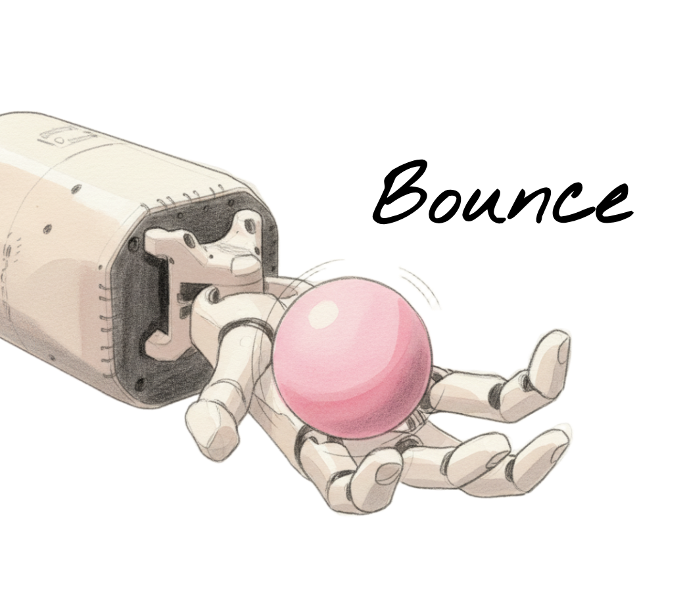
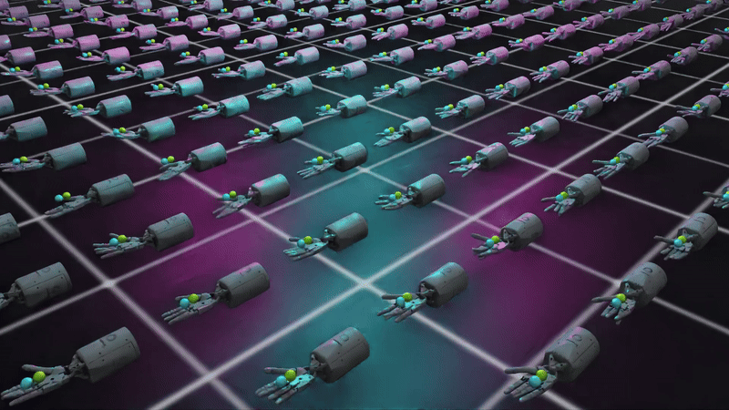
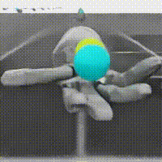
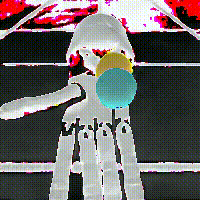
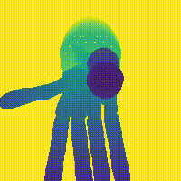

# RoTO: Robot Tactile Olympiad


RoTO is a **reinforcement learning benchmark environment** designed to standardise and promote future research in tactile-based manipulation. The reason we made this is because tactile RL is hard! We are dealing with a trifecta of manipulation, on-policy RL, and ML-unfriendly tactile data. By open-sourcing our environments and robustly tuned baselines, we hope to reduce the barrier to entry and enable researchers to prioritise fundamental algorithmic challenges over tedious RL tuning. We will continue to add more environments and strongly welcome contributions 🤗

### Key features
 - **5 robot embodiments**: 4× hands + 1× arm (Allegro Hand, ORCA Hand, Shadow Dexterous Hand, Shadow Dexterous Hand Lite, Franka)
 - **3 tactile-diverse tasks** to cover sparse, intermittent, and sustained interactions: find an object, ball bouncing, and Baoding ball rotation
 - **Integrated hyperparameter optimisation** with optuna — essential for tactile agents but often missing ❗
 - **Well-tuned baselines** for each robot-task-agent combo (40-trial sweep) that reach state-of-the-art speeds in sim

### Version history
- `roto 1.0` included the Find (Franka), Bounce & Baoding (Shadow Hand) tasks. It was introduced in [Enhancing Tactile-based RL for Robotic Control](https://elle-miller.github.io/tactile_rl/) (NeurIPS 2025), which shows that blind superhuman dexterity is possible with sparse binary contacts + self-supervision.
- `roto 2.0` is extended to include the Allegro, ORCA, and Shadow Dexterous Hand Lite robots for the Bounce & Baoding tasks. We swept hyperparameters for the full state & blind agents, and benchmarked the results in a 2-page [paper]((https://arxiv.org/abs/2605.21429v1)), accepted to ViTAC 2026 workshop at ICRA. See [project page](https://elle-miller.github.io/roto/) for some speedy agent videos.

The data 📁 for the NeurIPS paper and roto 2.0 ICRA workshop paper (checkpoints, training logs, plot scripts) are available in the [roto_paper_results](https://github.com/elle-miller/roto_paper_results) repo.

## ✨ Overview


We split the paper code across two repositories. Imagine the typical RL loop: you can think of `multimodal_rl` as the agent, and `roto` as the environment. We did this for modularity, in case you want to use your own RL repository instead of ours (there will be some integration to achieve this but happy to help).

`multimodal_rl`: The motto of this repo is _"doing good RL with Isaac Lab as painlessly as possible"_. We started from the [skrl](https://github.com/Toni-SM/skrl) library and made significant changes to better handle multimodal dictionary observations, observation stacking and associated memory management, and integrated self-supervision. Many existing libraries did not provide support for doing robust RL research (correct evaluation metrics, distinct train/evaluation envs, integrated hyperparameter optimisation). These are well established norms in the RL research community, but are not yet consistently present in RL+robotics research, which we want to encourage 🚀

`roto`: This repo just contains the robot configurations and task definitions. We take advantage of class inheritance to heavily reduce repeated code. `RotoEnv` is a child of `DirectRLEnv`, and sets up basic functions to perform joint position control of a robot and reset it. `[Robot]Env` is a child of `RotoEnv`, defining robot-specific functions that do not change task-to-task, e.g. the proprioceptive observation key. Finally, `[Task]Env` defines task-specific functions such as setting up the environment, rewards, and episode resets.


## 🤖 Environments

The agents are all joint position controlled. Franka has 9 joints, Shadow has 20 actuated joints.

| Environment | Description | Rewards | Robots|
| :---: | :--- | :--- |  :--- |
|  | The agent must locate a fixed ball on a plate as quickly as possible. | Distance reward from end-effector to ball | Franka |
|  | The agent must bounce a ball as many times as possible within 10s. | Sparse bounce bonus  | Shadow, ORCA, Allegro, Shadow Lite |
|  | The agent must rotate two small balls around each other as many times as possible within 10s. |  Small distance reward to ball target + successful rotation bonus  | Shadow, ORCA, Allegro, Shadow Lite |


## 🛠️ Installation

We need to install Isaac Sim, Isaac Lab, `multimodal_rl` and `roto` in a conda environment. We recommend using the latest Isaac Sim for maximum performance.

1. Create conda environment and install Isaac Lab and Isaac Sim (easiest to install both as [pip packages](https://isaac-sim.github.io/IsaacLab/main/source/setup/installation/isaaclab_pip_installation.html#))

2. Install [multimodal_rl](https://github.com/elle-miller/multimodal_rl) as a local editable package
```
git clone git@github.com:elle-miller/multimodal_rl.git
cd multimodal_rl
pip install -e .
```
3. Install `roto` as a local editable package
```
git clone git@github.com:elle-miller/roto.git
cd roto
pip install -e .
```
4. Test the installation by playing a trained agent.
```
# play in isaac sim viewer
python scripts/play.py --task Baoding --robot Shadow --num_envs 512 --agent_cfg forward_dynamics_memory --checkpoint readme_assets/checkpoints/baoding_memory.pt

# save a video
python scripts/play.py --task Baoding --robot Shadow --num_envs 512 --agent_cfg forward_dynamics_memory --video --video_length 1200 --headless --checkpoint readme_assets/checkpoints/baoding_memory.pt
```
The video should pop up in a `./videos` folder and look like this:



You can find more trained checkpoints in the [roto_paper_results](https://github.com/elle-miller/roto_paper_results) repository.


## 🏃 Usage
Mostly the same as default Isaac Lab setup. The only breaking change is that a given task is not linked to a cfg file. The cfgs must be defined in the task `__init__.py` and specified as an `agent_cfg` argument. 

We use `opunta` for integrated hyperparameter optimisation. The command is the same as for `train.py`, but with an additional `--study` name argument. You can specify the pruner, number of trials, number of warm up steps etc.

The basic commands are below. Note that when running for the first time, you will need to update your wandb entity, project etc. in the relevant .yaml file, and possibly some asset paths.

```
- {TASK} = [Find, Bounce, Baoding]
- {ROBOT} = [shadow, shadowlite, orca, allegro, franka]
- {CFG} = rl_only_pt (blind setting), rl_only_ptg (vision setting), forward_dynamics (blind + self-supervision), etc. or define your own

# training
python scripts/train.py --task {TASK} --robot {ROBOT} --agent_cfg {CFG} --num_envs 4196 --headless --seed 1234 

# sweeping
python scripts/sweep.py --task {TASK} --robot {ROBOT} --agent_cfg {CFG} --num_envs 4196 --headless --seed 1234 --study {YOUR_STUDY_NAME}

# playing - see final step in installation

# examples
python scripts/train.py --task Baoding --robot shadow --agent_cfg rl_only_pt --num_envs 4196 --headless
python scripts/train.py --task Bounce --robot orca --agent_cfg rl_only_ptg --num_envs 4196 --headless
python scripts/train.py --task Find --robot franka --agent_cfg forward_dynamics --num_envs 4196 --headless
python scripts/sweep.py --task Baoding --robot shadowlite --agent_cfg rl_only_pt --num_envs 4196 --headless --study lite_baoding_blind
```

## Observations

We use dictionary-style observations, and categorising into proprioception, tactile, rgb, depth, and gt (ground-truth). The proprioception & tactile methods should be defined in `{Robot}Env`, but gt information is task-dependent. To specify which observations are used, add the keys to `obs_list` in the agent cfg..
```
observations:
  obs_list:
  - prop
  - tactile
  - rgb
  - depth
  - gt
  obs_stack: 3
  tactile_cfg:
    binary_tactile: true
    binary_threshold: 0.01
  pixel_cfg:
    width: 80
    height: 80
    latent_pixel_dim: 128 
    normalise_rgb: true
    max_depth: 2.0  # meters
```
Here is an example rendering of raw RGB, normalised RGB, and depth of Shadow Baoding agent.




## 🤗 Contributing
We highly welcome community contributions and PRs! The most promising research directions we think are:
- Beyond sparse binary contacts to richer forms of tactile information
- ML methodologies with inductive biases for tactile data
- Expanding tasks. Our results indicate that while blind policies can approach privileged performance in simple tasks like bouncing, complex or multi-object manipulation (Baoding) remains an open challenge

## 📄 Citation

If you use this benchmark environment in your academic or professional research, please cite the following work:

```
@inproceedings{miller2025tactilerl,
  author    = {Miller, Elle and McInroe, Trevor and Abel, David and Mac Aodha, Oisin and Vijayakumar, Sethu},
  title     = {Enhancing Tactile-based Reinforcement Learning for Robotic Control},
  booktitle = {NeurIPS},
  year      = {2025},
}
```

## Contributors

`roto 2.0` (ICRA ViTac Workshop paper): original contributors with addition of:
- Jayaram Reddy — National University of Singapore
- [Ayush Deshmukh](https://www.linkedin.com/in/ayush-deshmukh-64b2b5226/) — University of Edinburgh

`roto 1.0` (NeurIPS 2025 paper): see citation above.

## 📧 Contact

For any questions, issues, or collaborations, please feel free to post an issue/start a discussion/reach out.

- Maintainer: Elle Miller
- Project Website: https://elle-miller.github.io/tactile_rl

This project is licensed under the BSD-3 License.


## 🎥 Videos

Full gallery: [project page](https://elle-miller.github.io/roto/).

In the below videos, "Vision" means the agent had access to object states, proprioception, and binary contacts. "Blind" means the agent only had proprioception and binary contacts. 

### Baoding task

**Shadow Hand**

<table>
<tr><th>Vision</th><th>Blind</th></tr>
<tr>
<td><video src="https://github.com/user-attachments/assets/f22b42c1-4fed-466b-bbce-0ccb6532a074" controls playsinline width="100%"></video></td>
<td><video src="https://github.com/user-attachments/assets/94b710d8-b7d2-4ded-b0ef-e1d942154dd2" controls playsinline width="100%"></video></td>
</tr>
</table>

**Allegro Hand**

<table>
<tr><th>Vision</th><th>Blind</th></tr>
<tr>
<td><video src="https://github.com/user-attachments/assets/49e58414-7b50-4fd9-93b5-612dbc22a91a" controls playsinline width="100%"></video></td>
<td><video src="https://github.com/user-attachments/assets/86984b31-bfdf-4dbd-89e8-deb575e50688" controls playsinline width="100%"></video></td>
</tr>
</table>

**ORCA Hand**

<table>
<tr><th>Vision</th><th>Blind</th></tr>
<tr>
<td><video src="https://github.com/user-attachments/assets/19e2c878-1c4e-4ba3-8792-1d9b0f4d8f76" controls playsinline width="100%"></video></td>
<td><video src="https://github.com/user-attachments/assets/5c55d6da-52ed-4479-973d-e9d2b9a73352" controls playsinline width="100%"></video></td>
</tr>
</table>

**Shadow Dexterous Hand Lite**

<table>
<tr><th>Vision</th><th>Blind</th></tr>
<tr>
<td><video src="https://github.com/user-attachments/assets/c8a1d95c-10e9-4402-9a9f-ce5a52cdaa9f" controls playsinline width="100%"></video></td>
<td><video src="https://github.com/user-attachments/assets/c6acc1c1-3133-44ab-85a1-91da06c2b0b5" controls playsinline width="100%"></video></td>
</tr>
</table>

### Bounce task

**Shadow Hand**

<table>
<tr><th>Vision</th><th>Blind</th></tr>
<tr>
<td><video src="https://github.com/user-attachments/assets/ddc1ca07-67d4-4c7d-a3d1-854e3b8b453d" controls playsinline width="100%"></video></td>
<td><video src="https://github.com/user-attachments/assets/eadd9bb1-f65e-4b06-9d1c-22f48c0488e7" controls playsinline width="100%"></video></td>
</tr>
</table>

**Allegro Hand**

<table>
<tr><th>Vision</th><th>Blind</th></tr>
<tr>
<td><video src="https://github.com/user-attachments/assets/4a1182f9-6e41-46bc-a192-dcccfb7d9ff6" controls playsinline width="100%"></video></td>
<td><video src="https://github.com/user-attachments/assets/82f16a08-81a1-4b68-b86b-5ebe026285c2" controls playsinline width="100%"></video></td>
</tr>
</table>

**ORCA Hand**

<table>
<tr><th>Vision</th><th>Blind</th></tr>
<tr>
<td><video src="https://github.com/user-attachments/assets/eec4dcae-5d4c-4ffa-b5b8-a993871bd15d" controls playsinline width="100%"></video></td>
<td><video src="https://github.com/user-attachments/assets/25158d10-4ae6-417c-9eef-030107709fe8" controls playsinline width="100%"></video></td>
</tr>
</table>

**Shadow Dexterous Hand Lite**

<table>
<tr><th>Vision</th><th>Blind</th></tr>
<tr>
<td><video src="https://github.com/user-attachments/assets/e57d20b0-66bf-47ee-b5d9-39bb6ba77124" controls playsinline width="100%"></video></td>
<td><video src="https://github.com/user-attachments/assets/2e66bc18-67e1-4aa2-b458-ffa5792e25d0" controls playsinline width="100%"></video></td>
</tr>
</table>


